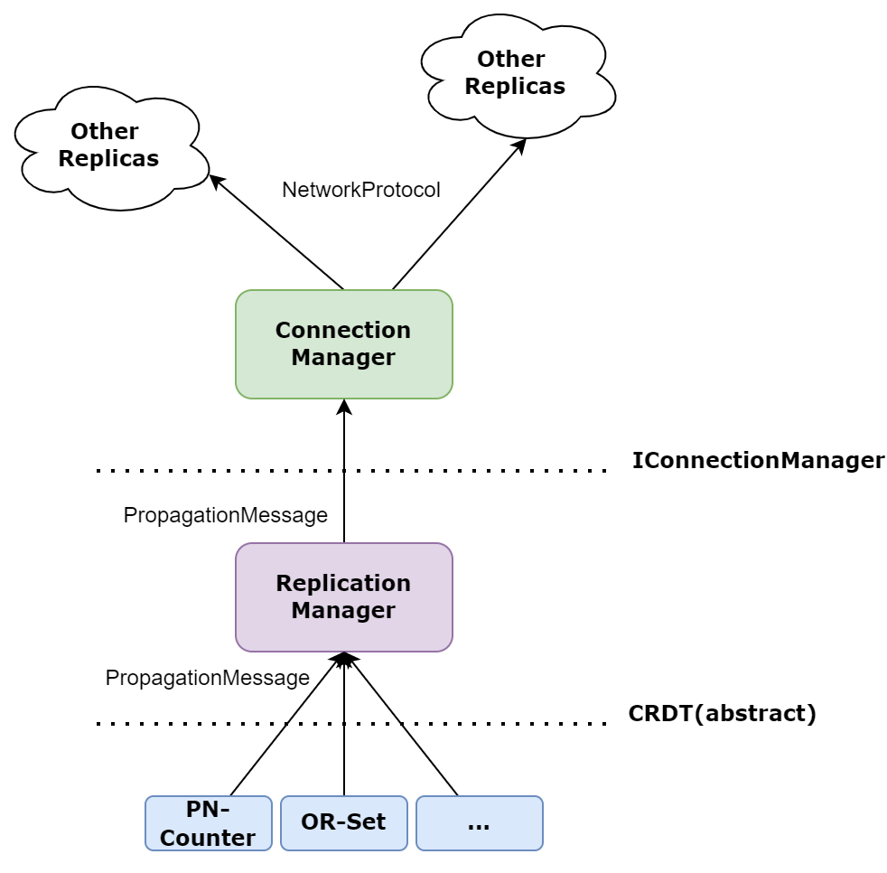

# MergeSharp

MergeSharp is a fast, lightweight and modular framework of Conflict-free Replicated Datatypes built for C# .Net. You can use it anywhere from IPC communication, to P2P collaborative systems thanks to its modularity. New CRDTs and communication methods can be easily added for extended capabilities that taloried to individual's need, and a portfolio of CRDTs are provided out-of-the-box.

## Sample App

https://github.com/peterwang06/BankingApp

## CRDT Background

Conflict-free Replicated Data Types (CRDTs) are a class of distributed data structures designed to enable seamless and efficient synchronization of replicated data across multiple nodes in a network. They were first introduced in 2011 by researchers Marc Shapiro, Nuno Preguiça, Carlos Baquero, and Marek Zawirski. CRDTs have since gained significant attention and have been applied in various distributed systems, such as collaborative editing applications, distributed databases, and peer-to-peer systems.

The primary goal of CRDTs is to handle concurrent updates from different nodes in a distributed system without requiring coordination or consensus. By ensuring that all replicas eventually converge to a consistent state, CRDTs provide strong eventual consistency. This property is particularly valuable in distributed systems where network latency, node failures, or intermittent connectivity can result in temporary inconsistencies between replicas.

CRDTs can be broadly classified into two categories: operation-based CRDTs (CmRDTs) and state-based CRDTs (CvRDTs).

* Operation-based CRDTs (CmRDTs): In this approach, updates are represented as commutative operations. These operations are transmitted to other replicas, which apply them locally to update their state. Since the operations are commutative, they can be applied in any order and still yield the same result. Examples of CmRDTs include counters, sets, and sequences.

* State-based CRDTs (CvRDTs): In this approach, the state of each replica is transmitted to other replicas, which merge the received state with their local state using a predefined merge function. The merge function must be idempotent, commutative, and associative to ensure convergence. Examples of CvRDTs include Grow-only Sets (G-Set), 2P-Sets (Two-Phase Sets), and LWW-Registers (Last-Writer-Wins Registers).

CRDTs provide several advantages in distributed systems:

* High availability: By avoiding the need for coordination or consensus, CRDTs can continue to operate even in the presence of network partitions or node failures.
* Low latency: Updates can be performed locally on each replica, reducing the latency experienced by users.
* Scalability: The decentralized nature of CRDTs allows for horizontal scalability, making them suitable for large-scale distributed systems.

Despite their advantages, CRDTs also have some limitations, such as increased storage and communication overhead due to the need to track metadata for conflict resolution. Nevertheless, CRDTs have proven to be a valuable tool in building robust, fault-tolerant distributed systems that can efficiently handle concurrent updates.

## Overview

MergeSharp consists of three major components, the CRDT, the Replication Manager and the Connection Manager. 




In most cases, users only interact with an instance of a CRDT to performance CRDT operations such as updates and reads. CRDT classes can be instantiated and used directly, however users would need to performance replication and synchronization manually. All CRDTs inherits from the abstract base CRDT class.

The Replication Manager is where the magic happens, when creating and accessing CRDTs through the Replication Manager, it automatically handles replication and synchronization without the need to modify CRDTs themselves. In addition, each instance of the Replication Manager acts like a replica. Just execute an update on one instance like a standalone one, it is automatically sync'd to all other replicas.

The Connection Manager handles communication among replicas. It is agnostic to the Replication Manager, therefore it is possible to implement any kind of communication method/network topology (IPC or over the network, fully connected or P2P). Note that some CRDTs may require different delivery guarantees, you need to make sure the Connection Manager provides such guarantees.

## Examples

### Using a standalone PN-Counter
```
PNCounter pnc1 = new PNCounter();
PNCounter pnc2 = new PNCounter();

pnc1.Increment(5);
pnc2.Decrement(8);
pnc1.Increment(10);
pnc2.Decrement(3);

PNCounterMsg update = (PNCounterMsg) pnc1.GetLastSynchronizedUpdate();
pnc2.Merge(update);

pnc1.Get(); => 2
pnc2.Get(); => 2
```

### Using Replication Manager
```

ConnectionManager cm0; 
ConnectionManager cm1;
// ... ConnectionManager initialized elsewhere ...

// Create two replicas, in reality this could be running
// on different processes
ReplicationManager replica0 = new(cm0);
ReplicationManager replica1 = new(cm1);

// A CRDT must be registered to the Replication Manager before used
replica0.RegisterType<PNCounter>();
replica1.RegisterType<PNCounter>();

// When creating a CRDT instance with the Replication Manager, it is
// assigned with an GUID, so that it can be retrieved from other replicas
Guid uid = replica0.CreateCRDTInstance<PNCounter>(out PNCounter pnc0);

// Get the counter from the other replica
PNCounter pnc1 = replica1.GetCRDT<PNCounter>(uid);   

// conduct operations normally
pnc1.Increment(5);
pnc2.Decrement(8);
pnc1.Increment(10);
pnc2.Decrement(3);

// values are automatically sync'd
// Note that, if it is over the network, there may be some delay
// before you could get the same value because of the nature of
// eventual consistency in CRDTs and network latency
pnc1.Get(); => 2
pnc2.Get(); => 2
```

## HowTos
### Add a new CRDT

1. Create a CRDT class that inherits from `abstract class CRDT`, see comment for the methods that needs to be implemented.
2. Create a anti-entropy message type depending on the design of your CRDT, and inherits from `abstract class PropagationMessage`, see comment for the methods that needs to be implemented..
3. Implement your CRDT with your states, update operations and query operations.
4. For all the update operations methods, mark it with `[OperationType(OpType.Update)]` attribute.
5. Include relevant tests, benchmarks and documentation.
6. For generic types and collections, make sure supplied type is serializable.

<div align="center">
  <h3>CRDTs Supported</h3>
  <a href="#GrowCounter">Grow Only Counter</a>
  — 
  <a href="#PNCounter">Positive Negative Counter</a>
  — 
  <a href="#2P Graph">Two Phase Two Phase Graph</a>
  — 
  <a href="#GSet">Grow Only Set</a>
  — 
  <a href="#LWW Register">Last-Write-Wins Register</a>
  — 
  <a href="#2PSet">Two-Phase Set</a>
   — 
  <a href="#GMS">Grow-Only Multiset</a>
   — 
  <a href="#LWWSet">Last-Write-Wins Multiset</a>
   — 
  <a href="#List">Grow-Only List</a>
   — 
  <a href="#GPQ">Grow-Only PriorityQueue</a>
   — 
  <a href="#GMAPA">Grow-Only Map</a>
   — 
  <a href="#String">Mutable String</a>
</div>
<hr>

<h3 id="GrowCounter"> Grow Only Counter </h3>

| What is it? | Capability | Practical UseCases | Merging Policy | 
|------|------------|----------|----------|
A counter that can only increase upwards. |  `+More memory efficient compared to other counters` `+Better performance compared to other counters` `-Does not support decrease operation` | Keeping track of everyone's ages as age can never go downwards. | Pick the greater value to resolve conflicts |

| Class | Method | Description |
|---|---|---|
| GCounterMsg | GCounterMsg() | Constructor that creates an empty instance of GCounterMsg |
|  | GCounterMsg(Dictionary<Guid, int> vector) | Constructor that creates an instance of GCounterMsg with the specified vector value |
|  | Decode(byte[] input) | Deserializes the input byte array and assigns the value of vector to the corresponding property of the GCounterMsg instance |
|  | Encode() | Serializes the GCounterMsg instance to a byte array |
| GCounter | GCounter() | Constructor that creates an empty instance of GCounter |
|  | Get() | Returns the sum of all the counter values across all replicas |
|  | Increment(int i) | Increments the counter value for the current replica by i |
|  | Merge(GCounterMsg received) | Merges the specified received GCounterMsg instance into the current GCounter instance |
|  | ApplySynchronizedUpdate(PropagationMessage ReceivedUpdate) | Applies the synchronized update from the specified ReceivedUpdate instance to the current GCounter instance |
|  | DecodePropagationMessage(byte[] input) | Deserializes the input byte array to a GCounterMsg instance |
|  | GetLastSynchronizedUpdate() | Returns the last synchronized update for the current GCounter instance |

<h3 id="PNCounter"> Positive Negative Counter </h3>

| What is it? | Capability | Practical UseCases | Merging Policy | 
|------|------------|----------|----------|
A counter that can go upwards and downwards |  `+Less memory efficient compared to other counters` `+Worst performance compared to other counters` `-Supports both increase and decrease increments` | User is modifying Reddit Comment thread both on his laptop and phone at the same time | Take the max of the positive counter. Take the max of the negative counter. The payload is the sum of the positive and negative counter. 

| Class | Method | Description |
|---|---|---|
| PNCounterMsg | PNCounterMsg() | Constructs a new empty PNCounterMsg object. |
|  | PNCounterMsg(Dictionary<Guid, int> pVector, Dictionary<Guid, int> nVector) | Constructs a new PNCounterMsg object with the given positive and negative vectors. |
|  | void Decode(byte[] input) | Decodes the given byte array into a PNCounterMsg object. |
|  | byte[] Encode() | Encodes this PNCounterMsg object into a byte array. |
| PNCounter | PNCounter() | Constructs a new empty PNCounter object with a new replica index, and initializes the positive and negative vectors with the replica index. |
|  | int Get() | Returns the current value of the PNCounter object by summing the positive vector and subtracting the negative vector. |
|  | void Increment(int i) | Increments the positive vector of the PNCounter by the given integer value. |
|  | void Decrement(int i) | Increments the negative vector of the PNCounter by the given integer value. |
|  | PropagationMessage GetLastSynchronizedUpdate() | Returns the last synchronized update of the PNCounter as a PNCounterMsg object. |
|  | void ApplySynchronizedUpdate(PropagationMessage ReceivedUpdate) | Applies the received PropagationMessage update to this PNCounter. |
|  | void Merge(PNCounterMsg received) | Merges the given PNCounterMsg object into this PNCounter. |
|  | PropagationMessage DecodePropagationMessage(byte[] input) | Decodes the given byte array into a PNCounterMsg object and returns it as a PropagationMessage. |

<h3 id="2P Graph"> Two Phase Two Phase Graph</h3>

| What is it? | Capability | Practical UseCases | Merging Policy | 
|------|------------|----------|----------|
A Graph CRDT capable of storing vertices and edges |  `+No graph data type in generic collections` `-Does not support adding back a removed edge` | Keeping track of network partitions | Takes the union |

| Class | Method | Description |
|---|---|---|
| TwoPhaseGraphMsg<T> | TwoPhaseGraphMsg() | Constructor that creates an empty instance of TwoPhaseGraphMsg<T> |
|  | TwoPhaseGraphMsg(HashSet<T> addVertices, HashSet<T> removeVertices, HashSet<(T, T)> addEdges, HashSet<(T, T)> removeEdges) | Constructor that creates an instance of TwoPhaseGraphMsg<T> with the specified addVertices, removeVertices, addEdges, and removeEdges values |
|  | Decode(byte[] input) | Deserializes the input byte array and assigns the values of addVertices, removeVertices, addEdges, and removeEdges to the corresponding properties of the TwoPhaseGraphMsg<T> instance |
|  | Encode() | Serializes the TwoPhaseGraphMsg<T> instance to a byte array |
| TwoPhaseGraph<T> | TwoPhaseGraph() | Constructor that creates an empty instance of TwoPhaseGraph<T> |
|  | AddVertex(T vertex) | Adds a vertex to the graph |
|  | RemoveVertex(T vertex) | Removes a vertex from the graph |
|  | AddEdge(T from, T to) | Adds an edge to the graph |
|  | RemoveEdge(T from, T to) | Removes an edge from the graph |
|  | ContainsVertex(T vertex) | Returns true if the graph contains the specified vertex, false otherwise |
|  | ContainsEdge(T from, T to) | Returns true if the graph contains the specified edge, false otherwise |
|  | Merge(TwoPhaseGraphMsg<T> received) | Merges the specified received TwoPhaseGraphMsg<T> instance into the current TwoPhaseGraph<T> instance |
|  | ApplySynchronizedUpdate(PropagationMessage receivedUpdate) | Applies the synchronized update from the specified receivedUpdate instance to the current TwoPhaseGraph<T> instance |
|  | DecodePropagationMessage(byte[] input) | Deserializes the input byte array to a TwoPhaseGraphMsg<T> instance |
|  | GetLastSynchronizedUpdate() | Returns the last synchronized update for the current TwoPhaseGraph<T> instance |

<h3 id="GSet"> Grow-Only Set</h3>

| What is it? | Capability | Practical UseCases | Merging Policy | 
|------|------------|----------|----------|
A set that only elements can be added to it |   `+Does not allow duplicate elements` `+Elements are sorted from least to greatest` `-Cannot remove an added element` `+Better performance and more memory efficient compared to other sets` | Add elements on the a list | Take the union of the conflicted sets |

| Class | Method | Description |
|---|---|---|
| GSetMsg<T> | GSetMsg() | Constructor that initializes an empty GSetMsg<T> object. |
|  | GSetMsg(HashSet<T> set) | Constructor that initializes a GSetMsg<T> object with the given set. |
|  | Decode(byte[] input) | Decodes the byte array input to a GSetMsg<T> object. |
|  | Encode() | Encodes the GSetMsg<T> object to a byte array. |
| GSet<T> | GSet() | Constructor that initializes an empty GSet<T> object. |
|  | Add(T item) | Adds an item of type T to the GSet<T> object. |
|  | Merge(GSetMsg<T> received) | Merges the GSet<T> object with the GSetMsg<T> object received as a parameter. |
|  | ApplySynchronizedUpdate(PropagationMessage ReceivedUpdate) | Applies the received synchronized update to the GSet<T> object. |
|  | DecodePropagationMessage(byte[] input) | Decodes the byte array input to a PropagationMessage object. |
|  | GetLastSynchronizedUpdate() | Returns the last synchronized update for the GSet<T> object. |
|  | Contains(T item) | Returns a boolean indicating whether the given item of type T is in the GSet<T> object. |
|  | CopyTo(T[] array, int arrayIndex) | Copies the elements of the GSet<T> object to an array of type T, starting at the specified array index. |
|  | GetEnumerator() | Returns an enumerator that iterates through the GSet<T> object. |
|  | Remove(T item) | Throws an InvalidOperationException because items cannot be removed from a G-Set. |
|  | Clear() | Throws an InvalidOperationException because a G-Set cannot be cleared. |


<h3 id="LWW Register">Last-Write-Wins Register</h3>

| What is it? | Capability | Practical UseCases | Merging Policy |
|------|------------|----------|----------|
| A data structure that stores a value along with a timestamp for each update. It resolves conflicts by considering the most recent update according to the timestamp. | +Allows concurrent updates +Automatically resolves conflicts +Simple implementation -Timestamp synchronization can be a challenge | Shared counters, user profile information, and distributed settings, where the most recent update should be preserved | Choose the value with the latest timestamp in case of conflicts |

| Class | Method | Description |
|---|---|---|
| LWWRegisterMsg<T> | LWWRegisterMsg() | Constructor that initializes an empty LWWRegisterMsg<T> object. |
|  | LWWRegisterMsg(T value, long timestamp) | Constructor that initializes an LWWRegisterMsg<T> object with the given value and timestamp. |
|  | Decode(byte[] input) | Decodes the byte array input to an LWWRegisterMsg<T> object. |
|  | Encode() | Encodes the LWWRegisterMsg<T> object to a byte array. |
| LWWRegister<T> | LWWRegister() | Constructor that initializes an empty LWWRegister<T> object. |
|  | Assign(T value, long timestamp) | Assigns the given value and timestamp to the LWWRegister<T> object if the given timestamp is greater than the current timestamp. |
|  | GetValue() | Returns the value stored in the LWWRegister<T> object. |
|  | ApplySynchronizedUpdate(PropagationMessage receivedUpdate) | Applies the received synchronized update to the LWWRegister<T> object. |
|  | DecodePropagationMessage(byte[] input) | Decodes the byte array input to a PropagationMessage object. |
|  | GetLastSynchronizedUpdate() | Returns the last synchronized update for the LWWRegister<T> object. |

<h3 id="2PSet"> Two-Phase Set </h3>

| What is it? | Capability | Practical UseCases | Merging Policy | 
|------|------------|----------|----------|
A set allowing to insert and remove elements |   `+Does not allow duplicate elements` `+Elements are sorted from least to greatest` `-Once an element is removed, cannot be added back in again` `+Average performance and more memory efficient compared to other sets` | A MMORPG where the set holds user information. If the user is banned, cannot be added back in again. | Takes the union |
  
| Class | Method | Description |
|---|---|---|
| TPSetMsg<T> | TPSetMsg() | Constructor that creates an empty instance of TPSetMsg<T> |
|  | TPSetMsg(HashSet<T> addSet, HashSet<T> removeSet) | Constructor that creates an instance of TPSetMsg<T> with the specified addSet and removeSet values |
|  | Decode(byte[] input) | Deserializes the input byte array and assigns the values of addSet and removeSet to the corresponding properties of the TPSetMsg<T> instance |
|  | Encode() | Serializes the TPSetMsg<T> instance to a byte array |
| TPSet<T> | TPSet() | Constructor that creates an empty instance of TPSet<T> |
|  | Add(T item) | Adds an item to the set |
|  | Remove(T item) | Removes an item from the set |
|  | LookupAll() | Returns a list of all items currently in the set |
|  | Equals(object obj) | Determines whether the specified object is equal to the current TPSet<T> instance |
|  | Clear() | Throws an InvalidOperationException because clearing a TPSet<T> is not supported |
|  | Contains(T item) | Returns true if the set contains the specified item, false otherwise |
|  | CopyTo(T[] array, int arrayIndex) | Copies the elements of the TPSet<T> object to an array of type T, starting at the specified array index. |
|  | Merge(TPSetMsg<T> received) | Merges the specified received TPSetMsg<T> instance into the current TPSet<T> instance |
|  | ApplySynchronizedUpdate(PropagationMessage ReceivedUpdate) | Applies the synchronized update from the specified ReceivedUpdate instance to the current TPSet<T> instance |
|  | DecodePropagationMessage(byte[] input) | Deserializes the input byte array to a TPSetMsg<T> instance |
|  | GetLastSynchronizedUpdate() | Returns the last synchronized update for the current TPSet<T> instance |
|  | GetEnumerator() | Returns an enumerator that iterates through the TPSet object. |
|  | GetHashCode() | Returns the hash code for the current TPSet<T> instance |

<h3 id="GMS"> Grow-Only Multiset </h3>

| What is it? | Capability | Practical UseCases | Merging Policy | 
|------|------------|----------|----------|
A multi-set where only elements are allowed to be added |   `+Allow duplicate elements` `-Does not support removing elements` `+Elements are sorted from least to greatest` `+More memory efficient compared to LWW` | To obtain chat log. Each message sent between multiple users is saved in the set. Since no message can be deleted, the uncensored log can be obtained | Takes the union |

| Class | Method | Description |
|---|---|---|
| GMultisetMsg<T> | GMultisetMsg() | Constructor that initializes an empty GMultisetMsg<T> object. |
|  | GMultisetMsg(Dictionary<T, int> multiset) | Constructor that initializes a GMultisetMsg<T> object with the given multiset dictionary. |
|  | Decode(byte[] input) | Decodes the byte array input to a GMultisetMsg<T> object. |
|  | Encode() | Encodes the GMultisetMsg<T> object to a byte array. |
| GMultiset<T> | GMultiset() | Constructor that initializes an empty GMultiset<T> object. |
|  | Add(T item) | Adds an item of type T to the GMultiset<T> object. |
|  | Count(T item) | Returns the count of the given item of type T in the GMultiset<T> object. |
|  | Merge(GMultisetMsg<T> received) | Merges the GMultiset<T> object with the GMultisetMsg<T> object received as a parameter. |
|  | ApplySynchronizedUpdate(PropagationMessage ReceivedUpdate) | Applies the received synchronized update to the GMultiset<T> object. |
|  | DecodePropagationMessage(byte[] input) | Decodes the byte array input to a PropagationMessage object. |
|  | GetLastSynchronizedUpdate() | Returns the last synchronized update for the GMultiset<T> object. |

<h3 id="LWWSet"> Last-Write-Wins Multiset </h3>

| What is it? | Capability | Practical UseCases | Merging Policy | 
|------|------------|----------|----------|
A multi-set where allowing for insertion and deletion |   `+Allow duplicate elements` `+Support removing elements` `+Elements are sorted from least to greatest` `+More memory efficient compared to LWW` | For the same shopping cart shared between multiple users | The last time stamp wins |

  | Class | Method | Description |
|---|---|---|
| LWWMultiSetMsg<T> | LWWMultiSetMsg() | Constructor that initializes an empty LWWMultiSetMsg<T> object. |
|  | LWWMultiSetMsg(Dictionary<T, long> addSet, Dictionary<T, long> removeSet) | Constructor that initializes an LWWMultiSetMsg<T> object with the given addSet and removeSet dictionaries. |
|  | Decode(byte[] input) | Decodes the byte array input to an LWWMultiSetMsg<T> object. |
|  | Encode() | Encodes the LWWMultiSetMsg<T> object to a byte array. |
| LWWMultiSet<T> | LWWMultiSet() | Constructor that initializes an empty LWWMultiSet<T> object. |
|  | Add(T item, long timestamp) | Adds an item of type T to the LWWMultiSet<T> object with the given timestamp. |
|  | Remove(T item, long timestamp) | Removes an item of type T from the LWWMultiSet<T> object with the given timestamp. |
|  | Contains(T item) | Returns a boolean indicating whether the given item of type T is in the LWWMultiSet<T> object. |
|  | Merge(LWWMultiSetMsg<T> received) | Merges the LWWMultiSet<T> object with the LWWMultiSetMsg<T> object received as a parameter. |
|  | ApplySynchronizedUpdate(PropagationMessage ReceivedUpdate) | Applies the received synchronized update to the LWWMultiSet<T> object. |
|  | DecodePropagationMessage(byte[] input) | Decodes the byte array input to a PropagationMessage object. |
|  | GetLastSynchronizedUpdate() | Returns the last synchronized update for the LWWMultiSet<T> object. |

<h3 id="List"> Grow-Only List</h3>

| What is it? | Capability | Practical UseCases | Merging Policy | 
|------|------------|----------|----------|
A array where only elements are allowed to be added |   `+Allow duplicate elements` `-Does not support removing elements` `+Elements are put in the order they come in` | To view the order at which users clock in at work. | Union in the order that it comes in. |

| Class | Method | Description |
|---|---|---|
| GListMsg<T> | GListMsg() | Constructor that creates an empty instance of GListMsg |
|  | GListMsg(List<T> elements) | Constructor that creates an instance of GListMsg with the specified elements value |
|  | Decode(byte[] input) | Deserializes the input byte array and assigns the value of elements to the corresponding property of the GListMsg instance |
|  | Encode() | Serializes the GListMsg instance to a byte array |
| GList<T> | GList() | Constructor that creates an empty instance of GList |
|  | Add(T item) | Adds the specified item to the current GList instance |
|  | LookupAll() | Returns a list of all elements in the current GList instance |
|  | Merge(GListMsg<T> received) | Merges the specified received GListMsg instance into the current GList instance |
|  | ApplySynchronizedUpdate(PropagationMessage ReceivedUpdate) | Applies the synchronized update from the specified ReceivedUpdate instance to the current GList instance |
|  | DecodePropagationMessage(byte[] input) | Deserializes the input byte array to a GListMsg instance |
|  | GetLastSynchronizedUpdate() | Returns the last synchronized update for the current GList instance |

<h3 id="GPQ"> Grow-Only PriorityQueue </h3>

| What is it? | Capability | Practical UseCases | Merging Policy | 
|------|------------|----------|----------|
A priority_queue where only elements are allowed to be added |   `+Allow duplicate elements` `-Does not support removing elements` `+Elements are sorted from greatest to least` `-Does not support random access` | To determine task priority | Takes the union |

| Class | Method | Description |
|---|---|---|
| GPriorityQueueMsg<T> | GPriorityQueueMsg() | Constructor that initializes an empty GPriorityQueueMsg<T> object. |
|  | GPriorityQueueMsg(SortedDictionary<int, T> priorityQueue) | Constructor that initializes a GPriorityQueueMsg<T> object with the given priorityQueue dictionary. |
|  | Decode(byte[] input) | Decodes the byte array input to a GPriorityQueueMsg<T> object. |
|  | Encode() | Encodes the GPriorityQueueMsg<T> object to a byte array. |
| GPriorityQueue<T> | GPriorityQueue() | Constructor that initializes an empty GPriorityQueue<T> object. |
|  | Add(int priority, T item) | Adds an item of type T to the GPriorityQueue<T> object with the given priority. |
|  | GetElementsInPriorityOrder() | Returns an enumerable of the items in the GPriorityQueue<T> object in priority order. |
|  | Merge(GPriorityQueueMsg<T> received) | Merges the GPriorityQueue<T> object with the GPriorityQueueMsg<T> object received as a parameter. |
|  | ApplySynchronizedUpdate(PropagationMessage ReceivedUpdate) | Applies the received synchronized update to the GPriorityQueue<T> object. |
|  | DecodePropagationMessage(byte[] input) | Decodes the byte array input to a PropagationMessage object. |
|  | GetLastSynchronizedUpdate() | Returns the last synchronized update for the GPriorityQueue<T> object. |
  
<h3 id="GMAPA"> Grow-Only Map</h3>

| What is it? | Capability | Practical UseCases | Merging Policy | 
|------|------------|----------|----------|
A map where only <key,value> pairs are allowed to be added |   `-Keys have to be unique`  `-Does not support removing elements` `+Keys are sorted from least to greatest` | Photo collaborator application settings | Greater value wins |

| Class | Method | Description |
|---|---|---|
| GrowOnlyMapMsg<TKey, TValue> | GrowOnlyMapMsg() | Initializes a new instance of the GrowOnlyMapMsg<TKey, TValue> class with an empty map. |
|  | GrowOnlyMapMsg(Dictionary<TKey, TValue> map) | Initializes a new instance of the GrowOnlyMapMsg<TKey, TValue> class with the specified map. |
|  | Decode(byte[] input) | Decodes a byte array and populates the map of the GrowOnlyMapMsg<TKey, TValue> instance. |
|  | Encode() | Encodes the GrowOnlyMapMsg<TKey, TValue> instance to a byte array. |
| GrowOnlyMap<TKey, TValue> | GrowOnlyMap() | Initializes a new instance of the GrowOnlyMap<TKey, TValue> class with an empty dictionary. |
|  | Put(TKey key, TValue value) | Inserts a key-value pair into the dictionary if the key does not already exist. |
|  | Get(TKey key) | Gets the value associated with the specified key, or the default value for the value type if the key does not exist. |
|  | ApplySynchronizedUpdate(PropagationMessage receivedUpdate) | Applies a synchronized update to the GrowOnlyMap<TKey, TValue> instance. |
|  | Merge(GrowOnlyMapMsg<TKey, TValue> received) | Merges the received GrowOnlyMapMsg<TKey, TValue> instance into the GrowOnlyMap<TKey, TValue> instance. |
|  | DecodePropagationMessage(byte[] input) | Decodes a byte array to a GrowOnlyMapMsg<TKey, TValue> instance. |
|  | GetLastSynchronizedUpdate() | Gets the last synchronized update as a GrowOnlyMapMsg<TKey, TValue> instance. |

<h3 id="String"> Mutable String </h3>

| What is it? | Capability | Practical UseCases | Merging Policy | 
|------|------------|----------|----------|
A mutable string where the text can be modified |   `+Support deletion of characters at any position` `+Support insertion of characters at any position` `+Ordering of characters in the string do not change` `-Does not always give the intended merge results that end-user wants` | Any collaborator text editor applications | Resolve conflict based on index of characters |

| Class | Method | Description |
|---|---|---|
| MStringIdentifier | MStringIdentifier(int position, Guid siteId) | Constructs a new MStringIdentifier object with the given position and site ID. |
|  | int CompareTo(MStringIdentifier other) | Compares this MStringIdentifier object with another MStringIdentifier object based on their positions and site IDs. |
| MStringEntry | MStringEntry(MStringIdentifier id, char value) | Constructs a new MStringEntry object with the given MStringIdentifier and character value. |
| MStringMsg | MStringMsg() | Constructs a new empty MStringMsg object. |
|  | MStringMsg(List<MStringEntry> entries) | Constructs a new MStringMsg object with the given list of MStringEntry objects. |
|  | void Decode(byte[] input) | Decodes the given byte array into an MStringMsg object. |
|  | byte[] Encode() | Encodes this MStringMsg object into a byte array. |
| MString | MString() | Constructs a new empty MString object with a random site ID. |
|  | void Insert(int index, char value) | Inserts the given character value at the given index in the MString. |
|  | void Delete(int index) | Deletes the character value at the given index from the MString. |
|  | string GetText() | Returns the text represented by the MString. |
|  | void ApplySynchronizedUpdate(PropagationMessage receivedUpdate) | Applies the received PropagationMessage update to this MString. |
|  | void Merge(MStringMsg received) | Merges the given MStringMsg object into this MString. |
|  | PropagationMessage DecodePropagationMessage(byte[] input) | Decodes the given byte array into an MStringMsg object and returns it as a PropagationMessage. |
|  | PropagationMessage GetLastSynchronizedUpdate() | Returns the last synchronized update of this MString as an MStringMsg object. |
|  | MStringIdentifier GenerateIdentifier(int index) | Generates a new MStringIdentifier object for the given index in the MString. |

## MIT License

Copyright (c) 2022 [Peter Wang, Leo Zhang, Muhammad Zaheer Hashmi, and Jason X.J.Z. Cheung]

Permission is hereby granted, free of charge, to any person obtaining a copy of this software and associated documentation files (the "Software"), to deal in the Software without restriction, including without limitation the rights to use, copy, modify, merge, publish, distribute, sublicense, and/or sell copies of the Software, and to permit persons to whom the Software is furnished to do so, subject to the following conditions:

The above copyright notice and this permission notice shall be included in all copies or substantial portions of the Software.

THE SOFTWARE IS PROVIDED "AS IS", WITHOUT WARRANTY OF ANY KIND, EXPRESS OR IMPLIED, INCLUDING BUT NOT LIMITED TO THE WARRANTIES OF MERCHANTABILITY, FITNESS FOR A PARTICULAR PURPOSE AND NONINFRINGEMENT. IN NO EVENT SHALL THE AUTHORS OR COPYRIGHT HOLDERS BE LIABLE FOR ANY CLAIM, DAMAGES OR OTHER LIABILITY, WHETHER IN AN ACTION OF CONTRACT, TORT OR OTHERWISE, ARISING FROM, OUT OF OR IN CONNECTION WITH THE SOFTWARE OR THE USE OR OTHER DEALINGS IN THE SOFTWARE.
